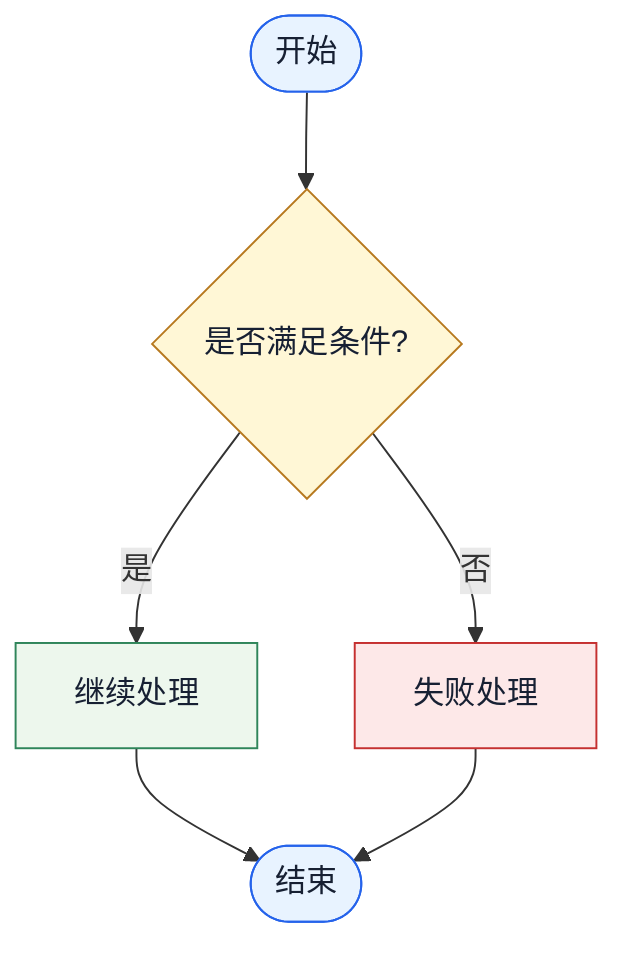

# HTML Mermaid 流程图

## 概述

当 HTML 输出需要流程图时，嵌入可在页面中渲染的 Mermaid 图。流程图必须忠于源码或文档逻辑，视觉上保持清爽，让读者能快速理解程序行为。

## 工作流程

1. 先从代码、日志、文档或用户描述中确认要展示的流程。
2. 选择最小够用的 Mermaid 图类型：
   - 普通程序流程或业务流程使用 `flowchart TD`。
   - 只有组件/角色之间的调用顺序是重点时，才使用 `sequenceDiagram`。
   - 只有状态和状态迁移是重点时，才使用 `stateDiagram-v2`。
3. 在 HTML 中用 `<pre class="mermaid">...</pre>` 或 `<div class="mermaid">...</div>` 包住 Mermaid 源码。
4. Mermaid 库加载后，只初始化一次。
5. 验证浏览器中显示的是渲染后的图，而不是原始 Mermaid 文本。

## HTML 写法

如果项目已有 Mermaid 依赖，优先复用项目依赖。独立静态 HTML 文件可以引入固定版本的 Mermaid 浏览器包，并显式初始化：

```html
<section class="flow-section">
  <h2>程序流程</h2>
  <pre class="mermaid">
flowchart TD
  start([开始])
  input[/接收输入/]
  validate{参数有效?}
  process[执行核心逻辑]
  save[(保存结果)]
  error[记录错误并返回]
  done([结束])

  start --> input --> validate
  validate -- 是 --> process --> save --> done
  validate -- 否 --> error --> done
  </pre>
</section>

<script src="https://cdn.jsdelivr.net/npm/mermaid@10/dist/mermaid.min.js"></script>
<script>
  mermaid.initialize({
    startOnLoad: true,
    theme: "base",
    securityLevel: "strict",
    flowchart: { curve: "basis", htmlLabels: false }
  });
</script>
```

使用 CSS 保证流程图可读，并允许小屏幕横向滚动：

```css
.flow-section {
  width: 100%;
  overflow-x: auto;
}

.mermaid {
  min-width: 640px;
  padding: 16px;
  border: 1px solid #d7dde5;
  border-radius: 8px;
  background: #ffffff;
}
```

## 流程图规则

- 节点 ID 使用 ASCII，节点标签使用简短的人类可读文字。例如 `validate{参数有效?}` 可以，直接把很长的代码表达式塞进标签里不可以。
- 每个节点定义里的 Mermaid 定界符必须成对闭合。常见合法写法包括 `node["标签"]`、`node{"标签"}`、`node(["标签"])`、`node[/"标签"/]`、`node[("标签")]`。
- 判断节点的引号必须在 `}` 前闭合。例如要写 `CHRG_CHECK{"IO_CHRG == 0 ?<br/>(充电 IC 正在充电?)"}`，不要写 `CHRG_CHECK{"IO_CHRG == 0 ?<br/>(充电 IC 正在充电?)}`。
- 带引号的节点标签内部不要再直接写裸双引号。可以改用单引号、去掉引号，或转义成 `&quot;`。
- 程序流程必须有清晰的开始节点和结束节点。
- 一个有意义的操作放一个节点，不要按源码一行一个节点机械展开。
- 分支判断使用菱形节点，并在边上标注 `是` / `否`、`成功` / `失败`，或明确条件。
- 错误、超时、重试、兜底路径会影响行为时，必须画出来。
- 跨模块、跨层级、跨任务或跨阶段时，使用 `subgraph` 分组。
- 过程型流程优先使用 `TD`，流水线或模块间关系优先使用 `LR`。
- 图超过约 20 个节点，或视觉上已经拥挤时，拆成多张图。
- 不要编造业务语义。源码或资料无法证明的分支，要标为“推断”，或先向用户确认后再写进图中。

## 样式建议

只有在能提升阅读效率时，才使用少量样式：



程序分析类 HTML 报告不要使用装饰性渐变、过大的标题、卡片套卡片或颜色过重的主题。流程图应当服务于解释，不要喧宾夺主。

## 验收检查

- 可行时，用浏览器打开 HTML，或运行对应页面。
- 确认 Mermaid 渲染出了 SVG 图，而不是直接显示 Mermaid 源码。
- 渲染前检查 Mermaid 源码：每一行只要包含 `["`、`{"` 或 `(["`，同一条逻辑节点定义里就必须有匹配的闭合引号和括号/大括号。
- 提取 Mermaid 块做校验时，只选择 class 精确包含 `mermaid` 的元素。不要把 `mermaid-wrap` 这类外层容器当成图源码。
- 检查桌面和移动端宽度下是否有标签截断、节点不可读或布局异常。
- 确认流程图和实际代码/文档流程一致。
- 如果 HTML 要离线分享，需要说明 CDN 依赖需要网络，或改成本地 Mermaid 包。
